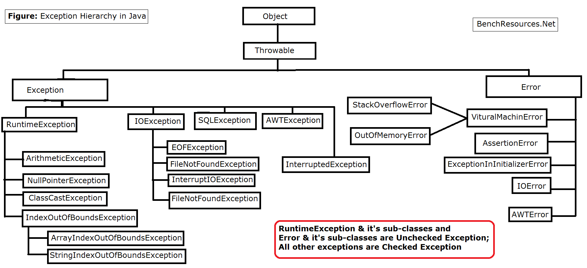

# Exception Handling
`JVM` нь програм ажилаж буй явцад Java програмчилал хэлийн хувьд утга зүй нь алдаа гаргсан үед алдаатай байгааг програмт `exception` байдалаар илгээдэг.
Энэ гарсан алдааг Java хэлд проррамистын тодорхойлж өгсөн газар руу нь ажилгаагаа шилжүүлнэ.
`Exception`-г `throw` буюу алдаа гарсан газараас шидээд түүнийг бариж авах газарт программын ажилгаагаа шилжүүлнэ.

Java хэлны хувьд `Throwable`-н яг доодох `subclass` нь `Exception` болон `Error` байна. Тэд нар нь бас доод доороо өөрийн гэсэн `subclass`уудтай байна. Үүнийг доорох зурагаас харна уу.


Бүх гарч болохүйц `exception` нь `Throwable` болон үүний `subclass`уудаас байна. Энэ объект нь тухай нь `exception` үүссэнээс хойш явар шийдэх `handler` таарах хүртлэх бүх мэдээлэлийг хадагалан.

Ямар нэгэн `exception` гарасан үед `JVM` нь огцом нэг нэгээр нь хийгдэх үйлдэлэлээ эхлүүдэг, харин ажилаж байгаа `thread`дээ гүйтгэн дуусгах албгүй. Энэ процесс нь түүнийг шийдэх `handler` ,тухайн нь `exception`-н классын нэр эсвэл түүний `superclass`-н нэр, олдох хүртэл үргэлжилнэ. Хэрэв ямар нэгэн `handler` байхгүй үед автоматаар `uncaught exception handler`-т удирлагаа шилжүүлнэ. Ингэснээр програмт гарж болохуйц бүх `exception` шийдэхгүйгээр ажилуулахгүй.

## `Exception`ны төрөл

`Exception` болон `Error` нь `Throwable`ын яг доод `subclass` юм.
- `Exception` нь бүх энгийн програм сэргэхийг хүсэх `exception`ны `superclass` юм.
- `Error` нь бүх энгийн програм дахин сэргэх боломжгүй `exception`ны `superclass` юм.
- `unchecked exception` нь бүх `RuntimeException` болон `Error` классууд юм.
    - Компайл хийгдэж байгаа үед шалгахгүй харин, програм ажилж буй үед гарч ирдэг `exception` юм.
    Жишээ: NullPointerException
    ```Java{.line-numbers}
    Object obj = null;
    obj.toString();  // This statement will throw a NullPointerException
    ```
- `checked exception` нь үлдсэн бүх класс юм.
    - Компайл хийгдэж байгаа шалагдаг ба түүнийг `throw` эсвэл `try ... catch` хйих ёстой.
    Жишээ: java.io.IOException
    ```Java{.line-numbers}
    public void ioOperation(boolean isResourceAvailable) {
    if (!isResourceAvailable) {
            throw new IOException();
        }
    }
    ```
    Дээрэх код койпайлдахгүй, яагаад гэвэл энэ код нь алдаа гарч болно гэвч түүнийгээ аргалаагүй. Үүнийг хочр яанзаар засаж болно.
    1. `try catch` ашиглах
    ```Java{.line-numbers}
    public void ioOperation(boolean isResourceAvailable) {
        try {
            if (!isResourceAvailable) {
                throw new IOException();
            }
        } catch(IOException e) {
            // Handle caught exceptions.
        }
    }
    ```
    2. `throw` ашиглах
    ```Java{.line-numbers}
    public void ioOperation(boolean isResourceAvailable) throws IOException {
        if (!isResourceAvailable) {
            throw new IOException();
        }
    }
    ```

## `Exception`ны үүсэх шалтгаан
- `Throw` statement ажилхад
- `JVM`-д шалагдсан гажиг явц
    - Java хэлны утга зүйн хувьд алдаатай, тоог тэгт хуваах
    - `LinkageError` үүссэн үед
    - Дотоод нөөц дууссан үлмаас алдаа заах
  
[Дэлэгрэнгүй](https://docs.oracle.com/javase/specs/jls/se7/html/jls-11.html)